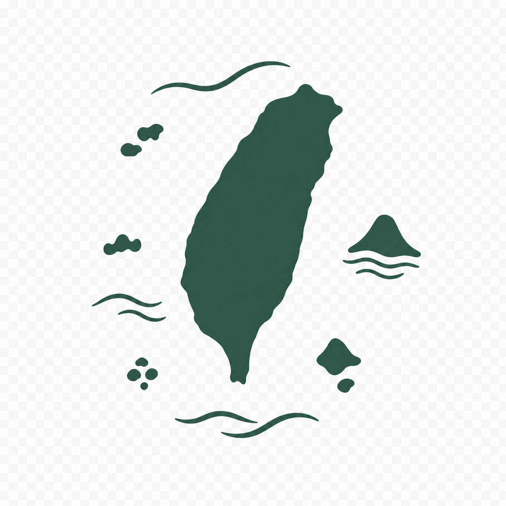

<p align="center">
  
</p>

<h1 align="center">Formoria</h1>

<p align="center">
  Taiwanese brand discovery and curation — find, compare and support brands that actually make things in Taiwan.
  <br>
  <a href="https://formoria.com"><strong>formoria.com →</strong></a>
</p>

---

## What it is

Formoria makes Taiwanese brands easier to discover, choose, and grow.

The foundation is a community-built directory: taxonomy filters, brand detail pages, product and purchase-channel information, and self-serve onboarding for brand owners. What sets it apart is a **3-tier manufacturing-verification ladder** — "Made in Taiwan" is a claim that ranges from fully domestic production to final assembly, and Formoria grades it rather than flattening it into a badge.

Brand data is community-submitted and reviewed before it goes live, so the directory stays trustworthy as it grows.

## Status

Live in production and actively developed. The directory, verification ladder, and owner onboarding all ship today.

An owner-led online select shop is the longer-term vision — it is **not** the current commerce model. Formoria does not sell anything right now; it points you to the brands that do.

## Stack

| Layer | Choice |
| --- | --- |
| Framework | Next.js 16 (App Router) + React 19 |
| Language | TypeScript (strict) |
| Data & auth | Supabase — Postgres, Auth, Storage |
| Styling | Tailwind CSS 4 |
| UI | HeroUI, Base UI, Radix primitives |
| i18n | next-intl (zh-TW / en) |
| Hosting | Railway |
| Analytics & monitoring | PostHog, GA4, Sentry |

Testing is Vitest for unit and integration, Playwright for end-to-end.

## Local setup

Requires **Node 20+** and pnpm (the repo pins `pnpm@10.30.1` via `packageManager`).

```bash
pnpm install
cp .env.example .env.local   # then fill in your own values
pnpm dev
```

That is enough to boot the app. `.env.example` documents every variable the project reads; you will need your own Supabase project for anything that touches data.

Once your Supabase project is linked, `make doctor` runs a full environment preflight — it checks tooling versions, required environment variables, and live database state. It is a verification step rather than a first-run gate: without a linked project it will report failures by design.

## Commands

| Command | What it does |
| --- | --- |
| `pnpm dev` | Start the dev server |
| `pnpm build` | Production build |
| `pnpm start` | Serve the production build |
| `pnpm lint` | ESLint plus the project's custom guards |
| `pnpm format` | Prettier |
| `pnpm test` | Unit and integration tests (Vitest) |
| `pnpm test:e2e` | End-to-end tests (Playwright) |
| `pnpm db:types` | Regenerate Supabase types from the linked project |
| `make doctor` | Environment preflight |

## Contributing

Spotted a brand listed incorrectly, or found a bug? See [CONTRIBUTING.md](CONTRIBUTING.md) — brand corrections and code issues take different paths.

## License

The source is public to read, but **all rights are reserved**. No license is granted to use, copy, modify, or redistribute this code. If you want to do something with it, open an issue and ask.
